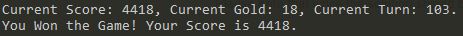

# Dragon Trainer

#### Table of Contents

* [Dragon Trainer](#dragon-trainer)   
  * [Picture of logic](#picture-of-logic)  
  * [10 Times Record](#10-times-test-record)
  * [Package Requirements](#package-requirements)  
  * [Usage](#usage)  
  * [Directory Structure](#directory-structure)  
  * [Mission Description](#mission-description)  


## Picture of logic
This is the logic of the project.
<!--  -->


## 10 Times Test Record

The average score: 1842.1
1. First Time - Score: 4418 - Date: 08-13-2019 18:22:05    


2. Second Time - Score: 1560 - Date: 08-13-2019 18:23:11    


3. Third Time - Score: 1961 - Date: 08-13-2019 18:24:02    


4. Fourth Time - Score: 3654 - Date: 08-13-2019 18:24:47    


5. Fifth Time - Score: 24 - Date: 08-13-2019 18:25:14    


6. Sixth Time - Score: 2696 - Date: 08-13-2019 18:25:48    

 
7. Seventh Time - Score: 818 - Date: 08-13-2019 18:26:18    


8. Eighth Time - Score: 835 - Date: 08-13-2019 18:26:53    


9. Ninth Time - Score: 1025 - Date: 08-13-2019 18:27:31    


10. Tenth Time - Score: 1430 - Date: 08-13-2019 18:28:12    


## Package Requirements

#### DragonTrainer.Backend
- AutoMapper
- NewtonSoft.Json

#### DragonTrainer.Backend.Tests
- NUnit
- NUnit3TestAdapter
- Moq

## Usage

#### DragonTrainer.Backend
Enter `DragonTrainer.Backend`, and then run command:
```csharp
dotnet run
```
#### DragonTrainer.Backend.Tests
Enter `DragonTrainer.Backend.Tests`, and then run command:
```csharp
dotnet test
```

## Directory Structure

#### DragonTainer.Backend

```csharp
├───DragonTrainer.Backend
│   ├───Core
│   │   ├───Missions
│   │   └───Shopping
│   ├───DTOs
│   │   ├───Investigation
│   │   ├───Missions
│   │   └───Shop
│   ├───Helpers
│   └───Services
│       └───Http
```

#### Core
- `Game.cs` defines the logic of the game.

##### Missions
- `MissionBoard.cs` defines a few operations of the Mission Board.
- `IWarrior.cs` defines an interface for different `Warriors`. But for now, there is only one Warrior.
- `NewbieWarrior.cs` implements the methods of `IWarrior.cs`.

##### Shopping
- `Store.cs` defines a few operations of the Shop.
- `IProcurementSolution.cs` defines an interface for different shopping solutions. But for now, there is only one solution.
- `NewbieProcurementSolution.cs` implements the methods of `IProcurementSolution.cs`.

#### DTOs
- `GameInfo.cs` is a container for the information from `/api/v2/game/start`
- `UserInfo.cs` is a container for user information. It contains the states of the game.

##### Investigation
- `Repulation.cs` is a container for the information from `/api/v2/:gameId/investigate/reputation`


##### Missions
- `MissionInfo.cs` is a container for information from `/api/v2/:gameId/messages`
- `MissionResult.cs`is a container for information from `/api/v2/:gameId/solve/:adId`

##### Shop
- `ItemInfo.cs` is a container for information from `/api/v2/:gameId/shop`
- `PurchaseResult.cs` is a container for information from `/api/v2/cs/shop/buy/KBvS5yT4`

#### Helpers
- `InfoHelper.cs` defines some static methods for displaying information on the console.
- `MapperHelper.cs` defines some operationgs for AutoMapper
- `ProbabilityHelper.cs` defines some properties for the difficulties of missions.

#### Services
- `GameService.cs` defines methods to send requests to `/api/v2/game/start`
- `InvestigationService.cs` defines methods to send requests to `/api/v2/:gameId/investigate/reputation`
- `MissionService.cs` defines methods to send requests to `/api/v2/:gameId/messages` and `/api/v2/:gameId/solve/:adId`
- `ShopService.cs` defines methods to send requests to `/api/v2/:gameId/shop` and `/api/v2/cs/shop/buy/KBvS5yT4`


##### Http
- `GameRequestor.cs` defines methods for Get and Post Requests.


## Mission Description

#### solution
only pick missions in difficulties with the following difficulty order. That means pick Sure thing first. If you cannot find sure thing anymore, pick piece of cake. And so on.
1. Sure thing
2. Piece of cake
3. Walk in the park
4. Quite likely
5. Hmmm....
6. Rather detrimental
7. Risky
8. Gamble
9. Playing with fire
10. Suicide mission

Once mission failed, check your lives and buy levels.
If gold is greater than 400, buy levels that cost 300 golds until you gold less then 400.  
If gold is greater than 200, buy levels that cost 100 golds until you gold less then 200.  


#### Special Symbol
Encrypted 1 = base64   
Encrypted 2 

#### equipment can add level number
300 gold add 2 levels  
100 gold add 1 level

#### Turns will affect the rate of success
The difficulty is higher when the the number of Turns is bigger.  
The difficulty is higher when the score is higher.
